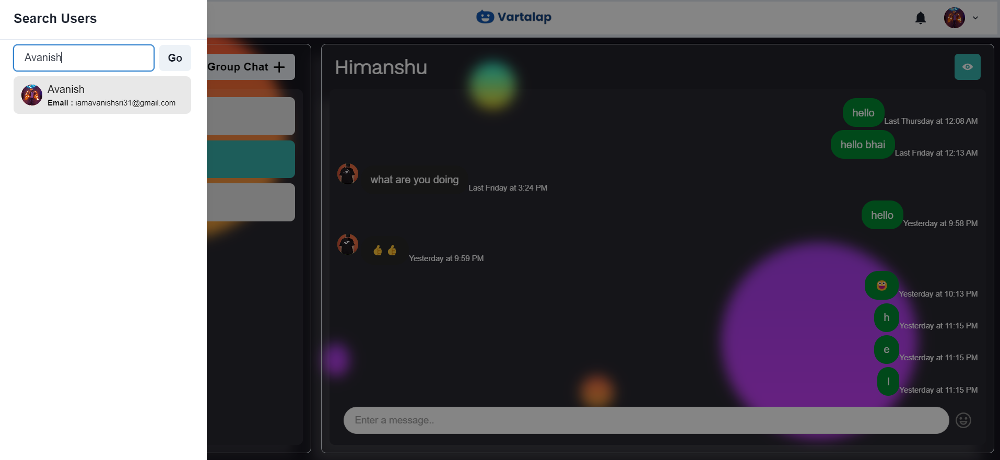
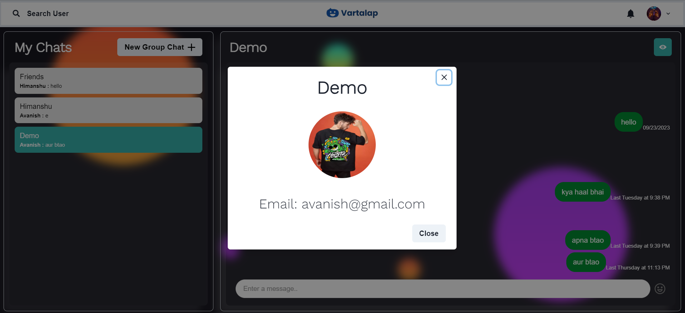

# React + Socket.io

This is the client application of Vartalap - A Chat App built with React + Socket.io.

## Features
1. Authentication


2. Real Time Chatting with Typing indicators

3. One to One chat

4. Search Users

5. Create Group Chats

6. Notification

7. Add or Remove users from group

8. View Other user Profile


## Install React
```
npx create-react-app 
```

## Select variant JavaScript and install dependencies
```
npm install
```

## Run and Production Build
```
npm run dev
npm run build
```

